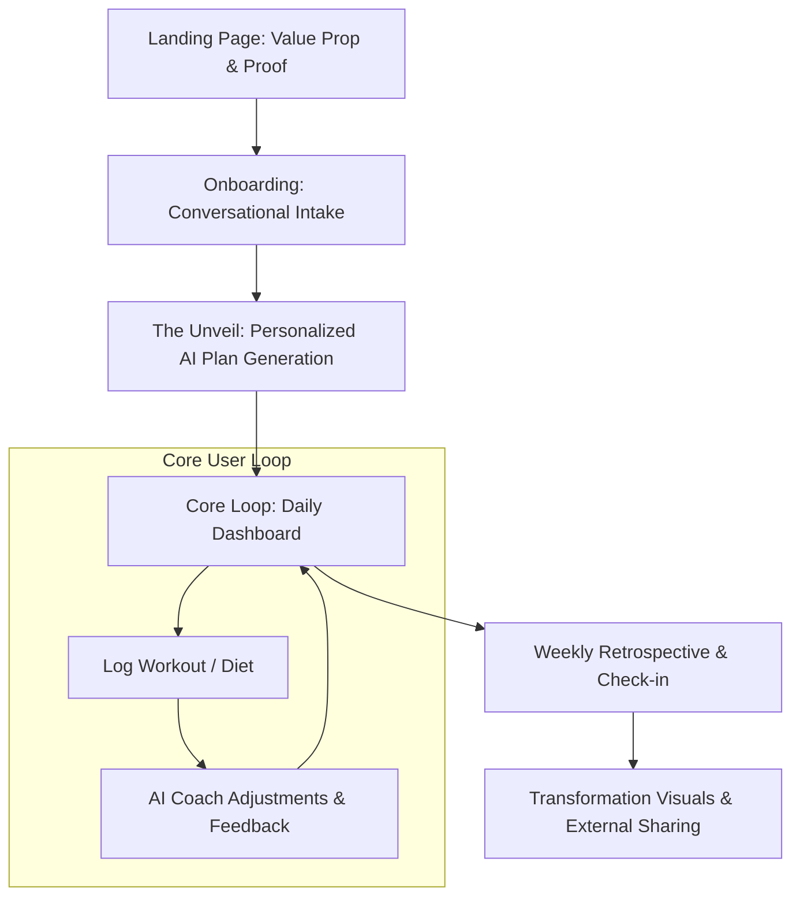
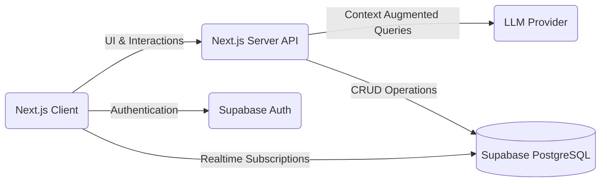
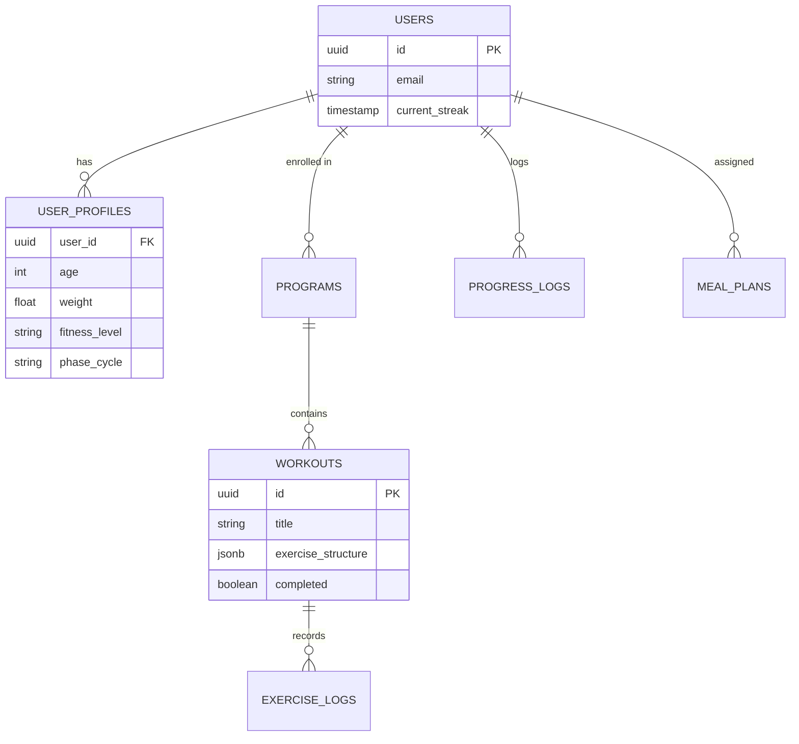
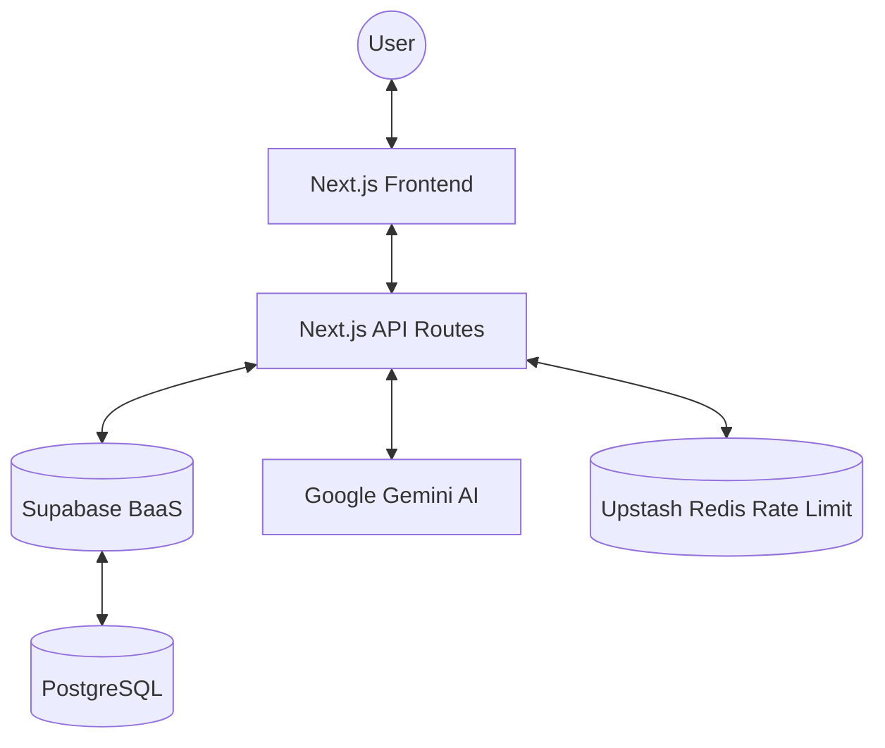
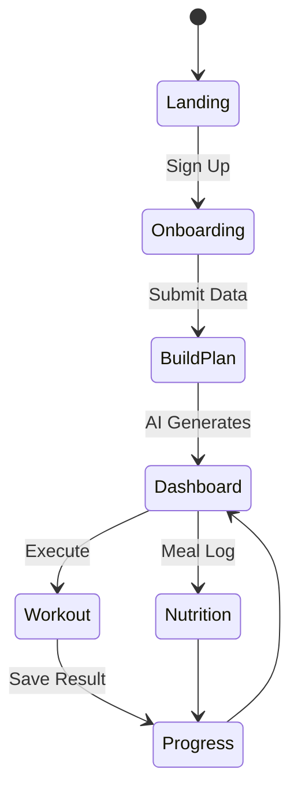
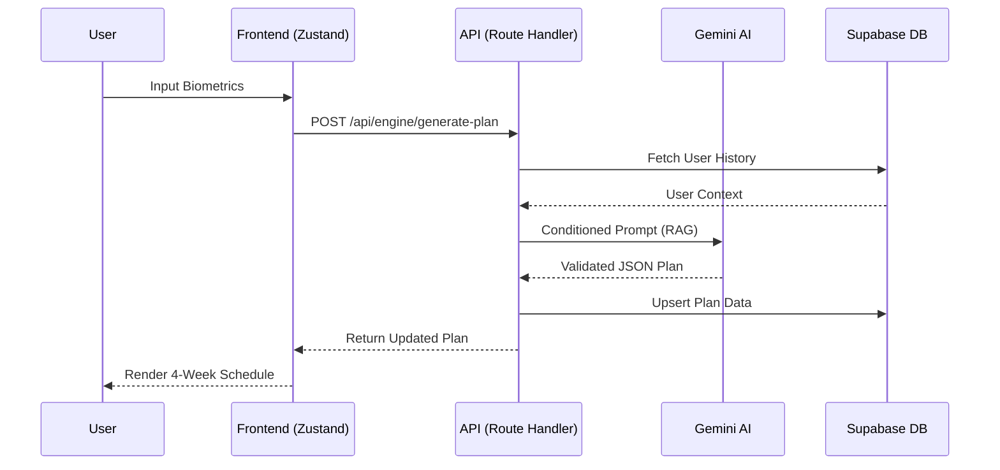

# 🌟 SheSync by Awdan Vibes
## Master Architecture & Product Blueprint

This document serves as the official master documentation and technical blueprint for **SheSync by Awdan Vibes**. It encompasses the strategic product vision, the comprehensive technical architecture, user experience design, and long-term scalability standards needed to build, maintain, and scale the platform.

> [!IMPORTANT]
> This master document is supported by specialized technical guides:
> - [Integration & Data Guide](file:///f:/Awdin/shesync/shesync_integration_guide.md) — Implementation details for developers.
> - [AI Master System Prompt](file:///f:/Awdin/shesync/shesync_master_prompt.md) — Foundation of the AI coaching logic.

---

## 1. PROJECT OVERVIEW

### Product Identity
- **Product Name:** SheSync by Awdan Vibes
- **Sector:** Health & Fitness Technology (FemTech / HealthTech SaaS)
- **Primary Interface:** Progressive Web Application (PWA) / Next.js Web App

### Purpose
SheSync is an intelligent, AI-powered fitness platform purposefully built to help women improve their health, confidence, and longevity through hyper-personalized training, tailored nutrition guidance, and empathetic digital coaching.

### Core Context & Positioning
- **The Problem:** The fitness industry is saturated with generic, "one-size-fits-all" programs that often ignore the physiological, hormonal, and lifestyle nuances of women. Human coaching is prohibitively expensive, while most apps provide rigid static plans that fail to adapt when life happens or physical states change.
- **Target Audience:** Modern women (ages 18–50) seeking a structured, empathetic, and holistic approach to fitness and nutrition. They value personalization, efficiency, and continuous support over intimidating, hyper-masculine fitness tropes.
- **Market Opportunity:** The intersection of FemTech and AI fitness is a rapidly growing vertical. Consumers are increasingly transitioning from static fitness apps to intelligent, adaptive systems that act as an affordable "coach in the pocket."
- **Core Value Proposition:** Elite-level, adaptive coaching tailored strictly for women—bridging the gap between a world-class personal trainer, a bespoke nutritionist, and a supportive community, all powered by advanced AI.

---

## 2. PRODUCT VISION

Our vision is to evolve SheSync from an intelligent workout application into a **dominant, definitive digital wellness ecosystem for women** globally.

1. **Phase I: AI Fitness App** - Establishing the core loop of hyper-personalized fitness and nutrition generation.
2. **Phase II: Digital Wellness Platform** - Integrating holistic wellness signals seamlessly (stress levels, hormonal cycle syncing, sleep quality) to alter fitness programming in real-time.
3. **Phase III: Community-Driven Health Ecosystem** - Transforming individual journeys into a massive multiplayer wellness experience. Fostering micro-communities, live events, user accountability groups, and eventually serving as the foundational platform for women's holistic health.

---

## 3. PRODUCT FEATURES

The SheSync platform is composed of distinct, deeply interconnected feature pillars:

### User Onboarding & Profiling
A beautiful, conversational intake flow that collects biometrics, past fitness history, available equipment, dietary preferences, constraints, and physiological data (e.g., menstrual cycle phase tracking).

### AI Fitness Coach
A conversational LLM-driven interface acting as a supportive companion. It can answer fitness-related questions, adjust difficulty dynamically ("I'm feeling sore today"), provide motivation, and explain the *why* behind the programming.

### Dynamic Workout Generator
An engine capable of generating logically sound, periodized training blocks. It adapts daily based on user feedback, time constraints, and available equipment without breaking the principles of progressive overload.

### Nutrition Planner
Macro-optimized meal generation aligned with the user's cultural preferences (e.g., MENA region specifics), budget, and dietary restrictions. Includes dynamic grocery list orchestration and alternative recipe substitutions.

### Progress Tracking
Comprehensive biometric logging including weight charts, body measurements, transformation photo timelines, and strength progression curves.

### Community Features
In-app "Squads" and topic-based forums where users can share wins, recipes, and struggles. Support systems engineered for accountability and social motivation.

### Gamification & Achievements
Streaks tracking, adherence scoring, and unlocking tiered badges (e.g., "Consistency Queen", "Iron Lifter") to create positive feedback loops and maximize retention.

### Analytics Dashboard
A personal command center providing users with historical data visualization, projecting future outcomes based on current adherence, and summarizing weekly achievements.

---

## 4. USER EXPERIENCE ARCHITECTURE

The SheSync experience is orchestrated to maximize the "Aha!" moment and ensure high daily active engagement.



### The Journey Breakdown
1. **Landing Page:** Emotionally resonant messaging followed by clear technical proof of the AI's capabilities.
2. **Onboarding:** Multi-step profiling. Feels like an interview with a premium coach rather than a clinical form.
3. **AI-Generated Plan:** A cinematic loading state that shows the AI "thinking" and "calculating" the optimal plan.
4. **Daily Workouts:** High-fidelity UI focusing on the task at hand. Clear video demonstrations, massive timers, and frictionless logging.
5. **Progress Tracking:** Reward loops triggered when inputting data, turning a chore into a dopamine-releasing event.
6. **Transformation Results:** Highly aesthetic, watermarked exportable summaries built for Instagram/TikTok virality.

---

## 5. INFORMATION ARCHITECTURE

The application is structured prioritizing actionable daily tasks while maintaining easy access to deep settings.

```
[ App Shell / Navigation ]
 ├── 🏠 Home (The Daily Command Center)
 │    ├── Today's Workout execution
 │    ├── Dietary Macros Summary
 │    └── Active Streak Status
 ├── 🏋️‍♀️ Train
 │    ├── Current Program Overview
 │    ├── Workout History & Library
 │    └── Exercise Substitution Library
 ├── 🤖 AI Coach
 │    ├── Conversational Chat Interface
 │    └── Quick Action Prompts (e.g., "Change my plan", "I'm injured")
 ├── 🥗 Nutrition
 │    ├── Daily Meal Plan
 │    ├── Recipe Databank
 │    └── Grocery List Generator
 ├── 📈 Progress
 │    ├── Weight & Measurement Tracking
 │    ├── Transformation Gallery
 │    └── Personal Records (PRs)
 ├── 👯‍♀️ Community
 │    ├── Main Feed & Inspiration
 │    └── Squads / Groups
 └── ⚙️ Profile & Settings
      ├── Biometric Updates
      ├── Subscription Management
      └── Integrations
```

---

## 6. TECHNICAL ARCHITECTURE

The system leverages a modern, highly scalable serverless stack designed for edge performance and minimal operational overhead.

- **Frontend Core:** Next.js (App Router, React Server Components)
- **Styling:** Tailwind CSS + custom shadcn/ui components (Radix primitives)
- **Backend/Database:** Supabase (PostgreSQL, GoTrue Auth, Row Level Security)
- **AI Layer:** LLM APIs (Google Gemini / OpenAI)
- **State Management:** Zustand (Client state), React Query / SWR (Server state & caching)



### System Strategies
- **Data Flow:** React Server Components handle heavy lifting and first-paint data fetching. Client components manage interactive features like workout timers and AI chat.
- **Authentication:** Supabase Auth (JWT) seamlessly integrates and passes tokens securely via cookies for Next.js SSR architecture.
- **Storage:** Supabase Storage buckets handle user-uploaded transformation photos, leveraging CDN caching.
- **Performance Strategy:** Edge caching for static assets, streaming responses for AI functionality (reducing perceived latency), and optimistic UI updates for workout logging.

---

## 7. CODEBASE STRUCTURE

SheSync follows a scalable, feature-first monorepo structure.

```text
/
├── src/
│   ├── app/                  # Next.js App Router (Routes & Layouts)
│   │   ├── (auth)/           # Grouped auth routes
│   │   ├── (dashboard)/      # Protected app routes
│   │   └── api/              # Serverless API endpoints & AI Webhooks
│   ├── components/
│   │   ├── layout/           # Structural components (Nav, Sidebar)
│   │   ├── ui/               # Standard UI components (Buttons, Inputs - shadcn)
│   │   └── shared/           # Shared domain components
│   ├── features/             # Feature-based domain logic
│   │   ├── workouts/         # Workout generation, logging logic
│   │   ├── nutrition/        # Recipe tracking, meal plans
│   │   ├── onboarding/       # Multi-step complex forms
│   │   └── coach/            # AI conversation logic & context
│   ├── lib/                  # Third-party instantiations (Supabase, AI)
│   ├── hooks/                # Custom React hooks
│   ├── types/                # Global TypeScript definitions & Zod schemas
│   └── utils/                # Pure helper functions (Dates, calculations)
├── supabase/
│   ├── migrations/           # Version-controlled SQL schemas & RLS policies
│   └── seed.sql              # Mock data for local testing
└── package.json
```
**Philosophy:** Keep the `app/` directory thin. Business logic and complex state should reside in highly testable chunks within the `features/` directory.

---

## 8. DESIGN SYSTEM

SheSync's visual language is engineered to evoke **trust, premium quality, and dynamic energy**.

- **Typography:**
  - *Headings:* Modern sans-serif (e.g., *Outfit* or *Clash Display*) for punchy, energetic headers.
  - *Body:* *Inter* or *Plus Jakarta Sans* for maximum readability in data-dense interfaces.
- **Spacing:** Strict 4-point baseline grid system ensuring absolute alignment.
- **Color Palette:**
  - *Primary:* Deep, sophisticated dark mode (Rich blacks and charcoals).
  - *Accents:* Energetic hues (Rose Gold, Teal, or Neon Violet) used sparingly to highlight primary actions and achievements.
- **Component Style (Glassmorphism & Depth):** Utilization of subtle frosted glass panels, smooth micro-animations, and elevated styling (via shadcn/ui) to ensure a high-fidelity feel.
- **Accessibility:** Strict WCAG AA compliance. High contrast ratios for gym environments (where glare is common). Tap targets sized gracefully for active scenarios.

---

## 9. AI SYSTEM DESIGN

The AI layer is the beating heart of SheSync, acting as the logic orchestrator. It is built on the **Awdan Vibes Coaching Methodology**, transitioning from simple LLM completions to a deterministic, behavioral-adaptive engine.

### 1. The Intelligence Pipeline
1. **Context Aggregation (RAG)**: Before sending a prompt, the system queries PostgreSQL for the user's biometric data, cycle phase, historical workout adherence, and injuries.
2. **System Prompting (The SheSync Persona)**: The context is stitched into a heavily engineered foundational prompt prescribing the "SheSync Coach"—an empathetic, scientifically accurate authority in female physiology.
3. **Deterministic Execution Logic**:
   - **Workout Generation**: Uses few-shot prompting alongside a strictly indexed **Exercise Library**. It is prohibited from hallucinating movements outside the clinical library.
   - **Nutrition Synthesis**: Logic is shifted from grams/macros to **food-based portions** (e.g., "1/2 Baladi bread") to match MENA cultural context.
4. **Behavioral Adaptation Engine**: The system actively monitors adherence. If a user's compliance drops below 60%, the engine automatically scales down difficulty and session frequency to prevent burnout.

### 2. Scientific Pillars
- **Hormonal Syncing**: Dynamic adjustment of intensity (RPE) based on the four phases of the menstrual cycle.
- **Progressive Overload**: Mandating a clear progression curve (W1: RPE 6, W2: RPE 7, W3: RPE 8, W4: Deload).
- **Injury Mitigation**: Hard-coded constraints that prevent programming movements that conflict with listed user restrictions.

---

## 10. DATA MODEL

The database is built on relational PostgreSQL utilizing foreign keys to maintain strict data integrity.


**Key Architecture Decisions:**
- Native Supabase Row Level Security (RLS) guarantees users can never query or mutate another user's biometric data.
- Heavy reliance on `jsonb` columns for highly flexible data like dynamic exercise sets, allowing future schema evolution without migrating complex rigid tables continuously.

---

## 11. GROWTH STRATEGY

Growth represents a hybridization of product-led loops and targeted marketing:

- **Organic & Viral Loops (The Transformation Engine):** Generate beautifully branded, data-rich progress infographics directly from the app. Users share these natively to Instagram/TikTok, creating zero-cost acquisition.
- **Content Marketing:** Programmatic SEO leveraging AI to generate authoritative articles on women's fitness, cycle syncing, and metabolic health.
- **Community Engagement:** "Workout with a friend" features and squad challenges that encourage internal virality.
- **Social Proof:** Timed App Store review prompts specifically after the "aha moment" (e.g., unlocking a streak badge).
- **Influencer Collaborations:** Partnering with micro-influencers in the women's fitness space to train their audiences utilizing SheSync logic.

---

## 12. MONETIZATION MODEL

SheSync employs a tiered SaaS structure optimized for high Lifetime Value (LTV).

- **Subscriptions (Core SaaS Engine):** Monthly/Annual recurring subscription granting full access to AI generation, tracking, and standard community features. (Follows a trial-first model).
- **Premium Plans (Hybrid Human + AI):** A high-ticket offering where users get the AI app, plus a monthly async check-in with a *real* human physiological coach who reviews the AI's data.
- **Coaching Packages (One-Off Specialties):** Specialized, finite programs (e.g., "12-Week Wedding Prep", "Postpartum Safe Core") that sit permanently in the user's library.
- **Corporate Wellness:** Selling licenses of SheSync to B2B partners aiming to improve modern employee health benefits.

---

## 13. DEVELOPMENT ROADMAP

### Phase 1: MVP (Minimum Viable Product)
- Implement Auth, secure routing, and Postgres schema.
- Build the conversational onboarding flow and core AI workout generation.
- Deploy the basic workout tracker and user profile dashboard.

### Phase 2: AI Coaching Expansion
- Implement the conversational AI chat interface.
- Launch the dynamic Nutrition Tracker and Recipe Generator.
- Introduce daily dynamic adjustments (AI reaction to skipped days or fatigue).

### Phase 3: Community and Gamification
- Roll out the Streaks, Badges, and Achievement system.
- Deploy Community Squads, leaderboards, and in-app forums.
- Build the high-fidelity shareable "Transformation Cards."

### Phase 4: Full Ecosystem
- Expand into specialized female biology logic (deep Hormonal Cycle syncing).
- Deliver Wearable integration (Apple Health/Garmin) syncing active calories and sleep.
- Extend platform into a fully fledged holistic AI health advisor.

---

## 14. PERFORMANCE OPTIMIZATION

- **Lazy Loading:** Components and images heavily lazy-loaded below the fold to ensure immediate Time-To-Interactive (TTI).
- **AI Streaming:** Utilizing Server-Sent Events (SSE) and Vercel AI SDK to stream tokens directly to the client. Drops perceived wait times for complicated coaching logic dramatically.
- **Image Optimization:** Mandatory utilization of `next/image` component to automatically convert all user uploads and assets to responsive WebP/AVIF.
- **Edge Functions:** Utilizing edge infrastructure to run lightweight authentication and validation logic close to the user, reducing central server strain.

---

## 15. SECURITY

- **Authentication:** Supabase JWT-based sessions. Optional MFA support integration for protective user tiers.
- **Data Protection:** Encryption at rest (PostgreSQL) and in transit (TLS). Highly sensitive biometric metrics mapping isolated.
- **Row Level Security (RLS):** Policies guaranteeing logical separation of tenant data; a user can only read/write against records owned by their specific `auth.uid()`.
- **Rate Limiting:** Usage of Upstash Redis rate limiters on costly LLM API endpoints to prevent financial abuse of the AI generation loops.
- **API Security:** Comprehensive payload validation utilizing generic `zod` schemas on every API entry point.

---

## 16. FUTURE EXPANSION

- **Mobile App:** Transitioning the PWA foundation into a fully native app built strictly via React Native (Expo) to secure App Store distribution and reliable push notifications.
- **Wearable Integration:** Direct hardware syncing with Whoop, Garmin, or Oura to pull real-time Recovery metrics straight into the AI's training decision engine.
- **Smart Fitness Tracking:** Utilizing device camera integration to offer computer vision-driven real-time squat and deadlift form correction.
- **AI Health Advisor:** Expanding beyond strict athletic fitness into broader preventative health recommendations, cycle correlation, and holistic wellness support.

---

## 17. CODEBASE ANALYSIS

As of March 2026, a comprehensive audit of the SheSync repository reveals a highly modular, Next.js 16-based architecture leveraging a "Feature-First" design pattern.

### 1. Current Folder Structure
- **`src/app`**: Native Next.js 16 App Router. Routes are logically grouped (e.g., `(dashboard)`, `(auth)`), with a robust serverless API layer in `src/app/api`.
- **`src/features`**: The core domain layer. Features like `onboarding`, `workout`, `nutrition`, and `ai-coach` encapsulate their own logic, components, and types.
- **`src/stores`**: Centralized state management using **Zustand**. Currently focused on user state (`useUserStore.ts`).
- **`src/lib`**: Third-party integration clients (Supabase, Upstash Redis).
- **`supabase/migrations`**: Version-controlled PostgreSQL schemas, ensuring database consistency across environments.

### 2. Key Modules
- **Onboarding Engine**: A complex 11-step wizard (`src/features/onboarding`) using React Hook Form and Zod for multi-step validation.
- **Plan Generation (The Engine)**: Located in `src/app/api/engine/generate-plan`, this is the most critical logic block, handling complex hormonal-syncing prompts.
- **AI Coach**: A conversational wrapper around `gemini-3.1-flash-lite-preview` with specialized system instructions for female physiology.

### 3. Supabase Integration
- Backend-as-a-Service (BaaS) providing **PostgreSQL**, **GoTrue Auth**, and **SSR-compatible clients**.
- Deep utilization of **Row Level Security (RLS)** to protect sensitive health metrics.

### 4. AI API Usage
- Primary Model: `gemini-3.1-flash-lite-preview`.
- Implementation: Server-side route handlers with exponential backoff retries and "fail-fast" logic to handle 429 rate limits gracefully.
- Output: Strict JSON schema enforcement for workout and nutrition instructions.

### 5. Architectural Issues Identified
- **Feature Redundancy**: Duplication between `src/features/workout` and `src/features/workouts`.
- **State Fragmentation**: State is split between Zustand and some legacy React Context in the onboarding flow.
- **Database Query Patterns**: High reliance on `jsonb` offers flexibility but may lead to performance degradation as the user base grows and complex reporting is required.

---

## 18. REFACTORING PLAN

To ensure the technical scalability for 100k+ users, the following refactoring roadmap is prescribed.

### Phase 1: Consolidation & Clean Architecture
1. **Merge Workout Features**: Consolidate `src/features/workout` and `workouts` into a single, unified domain module.
2. **Unified Store Implementation**: Move all global state (including onboarding progress) into a single, persisted Zustand store with selective middleware for persistence.
3. **Zod Schema Hardening**: Centralize all domain schemas into `src/types/schemas` to ensure 100% parity between frontend forms and backend API routes.

### Phase 2: Database & Performance
1. **Schema Normalization**: Extract frequently queried `jsonb` fields (like exercise types) into relational tables to improve query speed for analytics.
2. **AI Streaming Integration**: Full migration to the Vercel AI SDK to provide a "Typewriter" effect in the UI, reducing perceived latency for users.
3. **Edge Route Migration**: Transition heavy data-fetching routes to Next.js Edge Runtime to decrease TTFB (Time to First Byte).

---

## 19. SYSTEM ARCHITECTURE DIAGRAMS

### 1️⃣ High Level Architecture


### 2️⃣ User Flow Diagram


### 3️⃣ Data Flow Diagram


---

## 20. PRODUCT STRATEGY

### Market Positioning
SheSync is positioned as the **"Techno-Authoritative Female Wellness Leader"** in the MENA region. We occupy the space between "Generic Home Workout App" and "Expensive Human Coaching."

### AI Advantage
Unlike static apps, our AI understands **The Awdan Method**—deep hormonal cycle correlation. This creates a high switching cost; once the AI understands a user's physiological patterns over 3+ months, no generic app can compete with its precision.

---

## 21. GROWTH ENGINE

SheSync utilizes a "Tri-Loop" growth strategy:

1. **The Transformation Loop**:
   - User trains → Achieves result → App generates "Status Card" → User shares to Instagram/TikTok → New user joins.
2. **The Social Accountability Loop**:
   - Users join "Squads" → Squad challenges create internal engagement → Referral bonuses triggered for inviting friends to the squad.
3. **The Content Flywheel**:
   - AI-generated health insights are repurposed into programmatic SEO articles and viral "Fact vs Myth" social media content.

---

## 22. PRODUCT MOAT

1. **Hormonal Data Proprietary Model**: Our specific tuning for cycle-syncing fitness is a unique data asset.
2. **The Awdan Brand Authority**: Deep alignment with luxury wellness and MENA cultural nuances (Halal-friendly nutrition, modest-friendly workout environments).
3. **Community Lock-in**: User "Squads" create social stickiness that prevents churn even during periods of low workout adherence.

---

## 23. AI PROMPT ENGINEERING & MASTER SYSTEM PROMPT

This section documents the foundational system prompt logic used to drive the SheSync Engine (v1.0).

### 1. Core Identity: SheSync Coach
The AI is instructed to be a hybrid of a **certified female fitness specialist**, a **MENA-literate nutritionist**, and a **supportive habit coach**.

### 2. The Behavioral Adaptation Engine (Automatic Rules)
The engine triggers these logic shifts based on user behavior data:
- **Low Adherence (<60%)**: Reduce session count and duration. Note: "نبدأ بخطوة أصغر هذا الأسبوع."
- **Inconsistent Patterns**: If 3+ leg days are skipped, Day 1 of the new week is pivoted to Upper Body to rebuild momentum.
- **Cycle Phase Triggers**:
  - *Menstrual*: Lower RPE to 5. Focus on warm foods and iron-rich nutrition.
  - *Follicular*: Increase intensity; prime for PR attempts.
  - *Luteal*: Shift to moderate cardio; allow 70% dark chocolate; increase hydration.

### 3. Technical Constraints (The "Non-Negotiables")
- **Prompt Output**: MUST be raw JSON. No markdown, no prose.
- **Exercise Library**: Only use exercises from the verified `EXERCISE_LIBRARY_PLACEHOLDER`.
- **Portion Logic**: Nutrition must use MENA-specific portions (e.g., Baladi bread, Cottage cheese/Quraish) rather than macro grams.
- **Safety**: No medical diagnoses; no extreme deficits (>750 kcal/day); mandatory warm-ups (5-7 min).

### 4. Prompt Logic Schema
```json
{
  "user_profile": { "context_fields": "..." },
  "logic_gate": "Match(Equipment, Goal, CyclePhase, Adherence)",
  "output_requirement": "Deterministic JSON Structure"
}
```

---

*This document stands as the living technical and strategic foundational truth for SheSync operations, guiding all future development cycles and platform architecture decisions.*

---

## 24. SUPPLEMENTARY DOCUMENTATION

For deeper technical implementation, refer to:
- **[Integration Guide](file:///f:/Awdin/shesync/shesync_integration_guide.md)**: Details on Supabase triggers, API call structures, and asset extraction.
- **[Master System Prompt](file:///f:/Awdin/shesync/shesync_master_prompt.md)**: The full technical prompt used by the AI engine.
